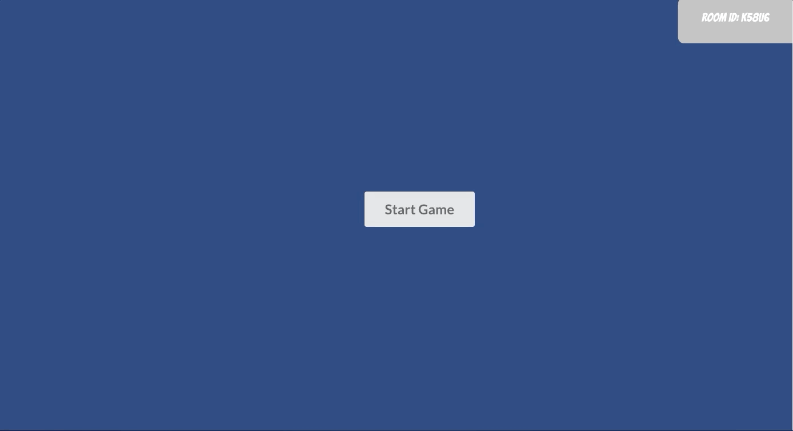

# A Quiplash Clone

> This is a game that gives users interesting prompts to answers in the wittiest way possible. Players in the room then vote on their favorite response.

> This was built with React, Redux, JavaScript, Node.js, and Socket.io 

Demo Videos
---------------

Demo Video: https://www.youtube.com/watch?v=7MitAf8JAB4&list=PLTEzQTnRayax_uKG7H4D91ybp0dg2mXg3&index=2&t=0s

Main-Lobby: Players joining in realtime

Player answering prompts (round 1)

Pictures of voting screens from players view and game view

Progress & Updates
---------------
This project is still a work in progress. Right now I have buttons to progress to the next round as well as getting the winner of each question. In the actual quiplash game, these things happen automatically. 
Also the styling is very particular as to which screens I intended my players to use. As you can see in the examples above, the best viewing expierence for the player is on their phone and the game view on a (1440 x 900) screen. Putting the game view on a monitor shifts around some of the buttons, timers, and text. 

